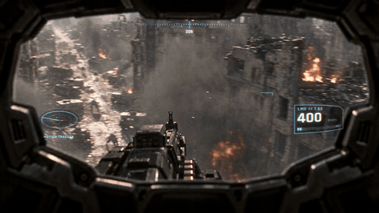
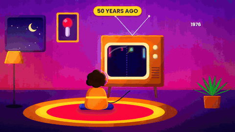

# AI Video Motion Graphics — free Claude skills

Teach Claude to make motion graphics, animated explainers, 3D animations and music videos. Claude writes the code, renders every frame and hands you back a finished MP4. You don't need to know how to code.

Created by **Tao Prompts** (AI video tutorials on YouTube).

**[⬇ Download the skills](https://github.com/tao-prompts/claude-motion-graphics/releases/latest)** · [How to install](#install-beginners-start-here) · [AI music video skill](#bonus-ai-music-video-skill)

---

## Styles

Every example below was made by Claude with these skills. Just ask for a style by name, for example *"use the vertical editorial style"*.

### Tutorial UI animations
16:9 YouTube tutorials and intros. Floating glass UI panels behind you, animated step lists, asset boards and bold titles over your talking head or AI clips.


### Vertical editorial style
9:16 shorts about news, money or history, in the style of Vox, Johnny Harris or The Economist. Paper textures, black and white photos, one red accent, animated charts and counters, split screens.


### AI-video overlays
Graphics that live inside AI-generated scenes: tracked HUDs, helmet visors, target scanners, billboards and before/after reveals.



### 2D animated explainer
A fully animated science or idea explainer driven by your voiceover, with no footage needed. Bright flat characters, isometric worlds, holograms and story-driven transitions.



### 3D voxel animation
A continuous 3D zoom through scales or worlds, like "Powers of Ten": galaxy → planet → tree → cell → DNA → atom, all built from colourful clay-like cubes.


---

## Bonus: AI music video skill

A second skill in the same download. It makes a hand-painted 2D cartoon music video, built entirely in code and synced to your song. Claude helps you write the song, designs the characters and worlds, then animates them dancing and performing with glowing lyric text.


Download **`ai-music-video-animation.zip`** from the [Releases page](https://github.com/tao-prompts/claude-motion-graphics/releases/latest) and install it the same way as below. Try: *"Help me make a 40-second animated music video about two characters who meet inside a computer."*

---

## Install (beginners start here)

You need a paid Claude plan (Pro, Max, Team or Enterprise), because skills run code.

1. **Download the skill.** Go to the [**Releases**](https://github.com/tao-prompts/claude-motion-graphics/releases/latest) page and download **`ai-video-motion-graphics.zip`** (and **`ai-music-video-animation.zip`** if you want the music video skill). Don't unzip them.
2. **Turn on code execution.** In the Claude app or at claude.ai, open **Settings → Capabilities** and switch on **Code execution and file creation**.
3. **Upload the skill.** On the same page, under **Skills**, click **Upload skill** and pick the zip you downloaded. Repeat for the second zip.
4. **Try it.** Start a new chat and type one of the prompts below.

The first time you use it, Claude installs everything it needs on its own.

### Prompts to try

- *"Write a 40-second explainer script about black holes, then animate it as a 2D animated explainer."*
- *"Add tutorial UI animations to my talking-head intro."* (attach your video)
- *"Turn this clip into a vertical editorial short."* (attach your video)
- *"Add a sci-fi HUD overlay to this AI video."* (attach your video)
- *"Make a 3D voxel animation zooming from the Milky Way down to an atom."*

You can switch styles any time: *"switch to the vertical editorial style"*.

---

## Install in Claude Code (if you use the terminal app)

Run these two commands inside Claude Code. You get both skills:

```
/plugin marketplace add tao-prompts/claude-motion-graphics
/plugin install ai-video-motion-graphics@tao-prompts
```

Or copy the folders inside `skills/` into `~/.claude/skills/`.

**ffmpeg:** Claude Code runs on your own computer, so you also need [ffmpeg](https://ffmpeg.org/download.html). If it's missing, Claude will tell you the one-line command to install it, or run it for you.

---

## What's inside

- `skills/ai-video-motion-graphics/`: the motion graphics skill (instructions, style rules, animation and sound toolkits, worked examples)
- `skills/ai-music-video-animation/`: the music video skill (painting engine, characters, environments, props, lyric text effects, a full example)
- `examples/`: the preview animations on this page

Nothing in these skills calls a paid API. Every graphic and sound is generated in code.

## License

The code and instructions are released under the [MIT License](LICENSE). Bundled fonts keep their own open licenses (see each skill's font folder).
